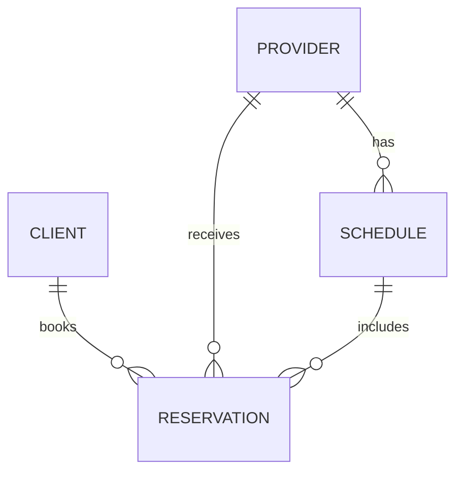

# ReservationApp
A healthcare app that allows clients to book reservations for health care providers based on the [HenryMeds take home coding challenge](https://henrymeds.notion.site/Reservation-Frontend-164fbd0f25034d05bf94da24d91af94c).

## Requirements
- [x] Allows providers to submit times they’d like to work on the schedule.
- [ ] Allows clients to list available slots.
- [ ] Allows clients to reserve an available slot.
    - [ ] Reservations expire after 30 mins if not confirmed.
    - [ ] Reservations must be made at least 24 hours in advance.
- [ ] Allows clients to confirm their reservation.

## Entity Relationship Diagram

### Relationships
* A CLIENT can book multiple RESERVATIONs, but each RESERVATION is booked by one CLIENT.
* A PROVIDER can have multiple RESERVATIONs, but each RESERVATION is associated with one PROVIDER.
* A PROVIDER has multiple SCHEDULE entries, but each SCHEDULE is associated with one PROVIDER.
* A SCHEDULE can be included in multiple RESERVATIONs, but each RESERVATION is linked to one SCHEDULE.
