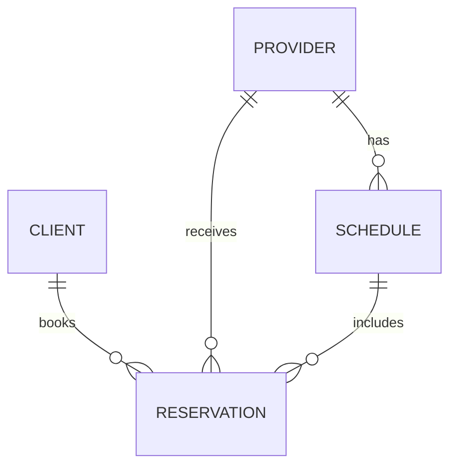

# ReservationApp

A healthcare app that allows clients to book reservations for health care providers based on
the [HenryMeds take home coding challenge](https://henrymeds.notion.site/Reservation-Frontend-164fbd0f25034d05bf94da24d91af94c).

## Demo

[Demo](https://drive.google.com/file/d/1PRG5ujy5GaQJYaCso2H7RqaLZM9oYYxN/view?usp=sharing)

## Requirements

- [x] Allows providers to submit times they’d like to work on the schedule.
- [x] Allows clients to list available slots.
- [x] Allows clients to reserve an available slot.
    - [x] Reservations must be made at least 24 hours in advance.
- [x] Allows clients to confirm their reservation.

## Tradeoffs

Overall I was able to support most of the core requirements for this app. Given the limited amount
of time, here are the tradeoffs I made:

* For the data layer, I decided to use an in memory cache since there is no API provided. In a
  production app I would leverage Retrofit to fetch the data from an API and likely cache the data
  in a Room database to provide offline mode support.
    * This approach allowed me to move much faster and allowed me to focus on the core
      requirements.
* I decided to hardcode the provider and client instead of allowing the user to choose from a list.
  This would have been a nice addition to showcase how the data is tied to multiple clients and
  providers. However, the way I implemented the app allows support for this, there just needs to be
  additional UI to enable this
* I would have liked to add a bit more detail to the UI overall. Such as adding more animations and
  images for providers and clients but this was lower on the priority list.
* There definitely could be better error handling and date validation. For example, past dates can
  be scheduled. Also when selecting the times for the provider schedules, the app doesn't ensure the
  start time is before the end time.
* There were a few areas in the UI that are repetitive, using more reusable composable functions
  could be a nice add given more time.
* I also didn't have time to write any tests. I always ensure there are automated unit and UI tests
  before shipping features for production apps to ensure no regressions are introduced. I organized
  the code in a way to add unit tests however. For example, the view model classes can easily be
  unit tested with the data source dependency injected as an interface.
* Concurrency - I decided to implement everything on a single thread for this challenge in order to
  save time. However, in a production app, it is necessary to leverage concurrency in order to avoid
  poor user experiences. For example, if we were fetching data from the network, this work must be
  done on a background thread in order to prevent ANRs and the UI from completely freezing. I prefer
  to use Kotlin Coroutines for concurrency in Android apps.

## Architecture

- MVVM
- Hilt - Dependency Injection
- Jetpack Compose - UI
- Jetpack Compose Navigation
- Jetpack Libraries - Compose Screen Navigation, Lifecycle, and ViewModel

## Entity Relationship Diagram

Here's a diagram I generated with ChatGPT based on the data layer to help provide a better visual of
the data relationships.

### Relationships

* A CLIENT can book multiple RESERVATIONs, but each RESERVATION is booked by one CLIENT.
* A PROVIDER can have multiple RESERVATIONs, but each RESERVATION is associated with one PROVIDER.
* A PROVIDER has multiple SCHEDULE entries, but each SCHEDULE is associated with one PROVIDER.
* A SCHEDULE can be included in multiple RESERVATIONs, but each RESERVATION is linked to one
  SCHEDULE.
